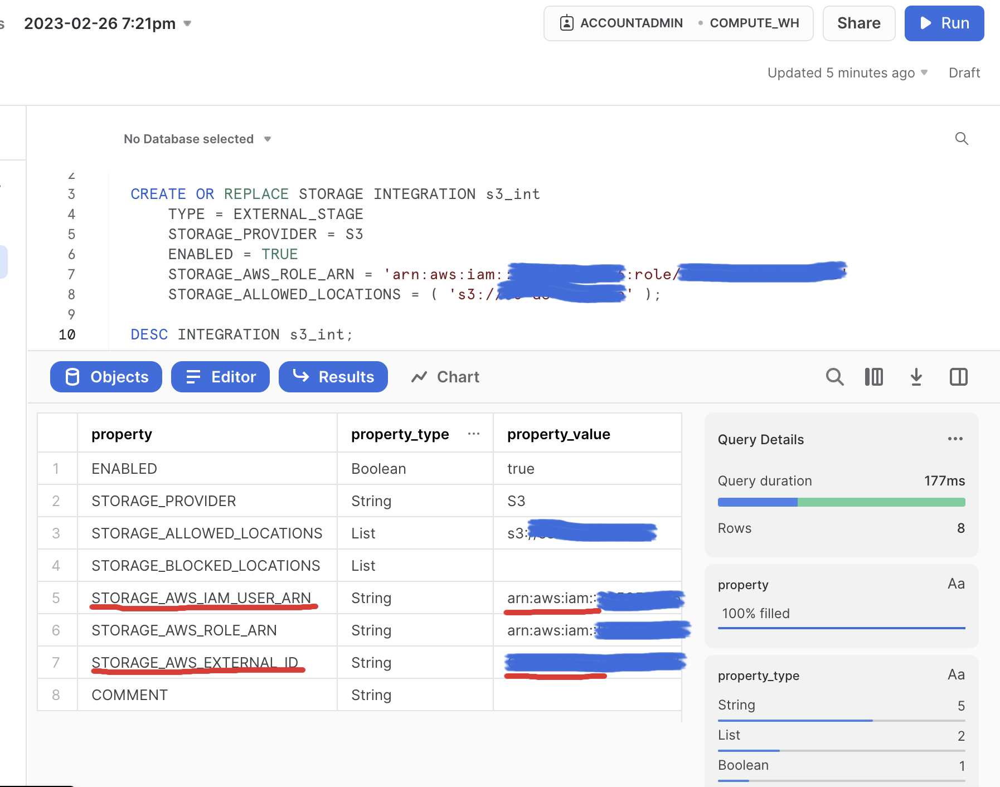
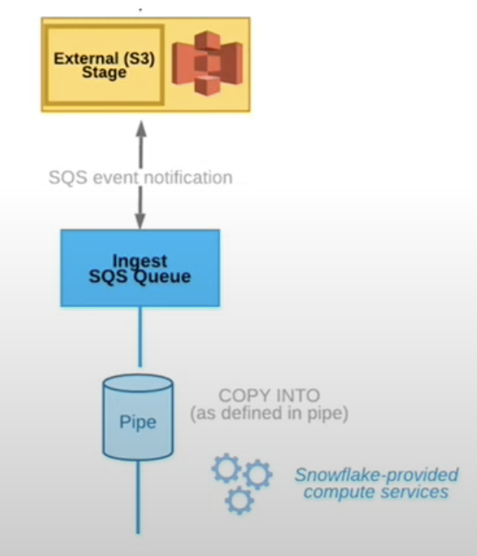
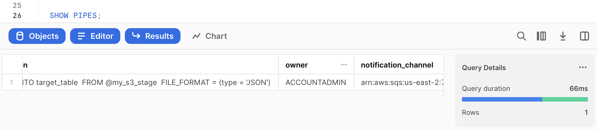
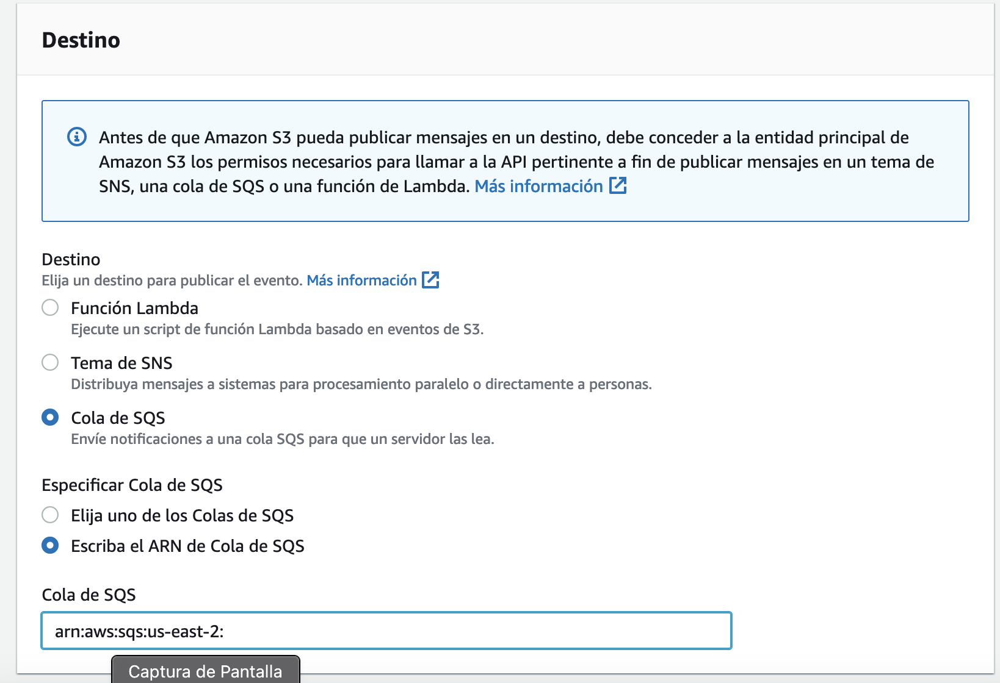

# Datalake-with-S3-and-Snowflake
## Setup
1. Get an AWS account and get your [access keys](https://docs.aws.amazon.com/IAM/latest/UserGuide/id_credentials_access-keys.html) 
2. Install the [AWS CLI](https://aws.amazon.com/cli/)
3. Get a [Snowflake account](https://signup.snowflake.com/)
4. Configure your AWS CLI with your IAM Access Keys:
```
# Sometimes you need to run it with sudo
aws configure
```
5. Enter your credentials and select your best configuration:
```
AWS Access Key ID [****************TWUX]: *
AWS Secret Access Key [****************9rWg]: *
Default region name [None]: us-east-1
Default output format [None]: json
```

## Practice
### AWS
- Create a new S3 bucket using the CLI (The name must be globally unique):
```
# You also can run without region param and it wil
aws s3 mb s3://YOURbucketNAME --region us-east-2
```
Alternative you can create directly from [AWS console](https://docs.aws.amazon.com/AmazonS3/latest/userguide/GetStartedWithS3.html)

- Create a new access policy for the previous bucket using CLI:
```
aws iam create-policy --policy-name my-snowflake-policies --policy-document s3-policy.json --region us-east-2
```

If you don't have iam:CreatePolicy attach to your AWS user you can do it using [AWS console](https://docs.aws.amazon.com/IAM/latest/UserGuide/access_policies_create-console.html).
Please check the content of the s3-policy.json in order to know which policies attach.

- Create a new role using our previous policies

1. Go to your AWS account console.

2. Go to the IAM section (You can use the AWS browser to achieve it)

3. Click on the left bar on the part of "Roles"

4. Select "Another AWS account" and use your same Account ID.

5. Select the "External ID" option and use a random number like "0000".


6. Select the policy that you've created in the previous step.


7. Write a name for your role and a description. That's it.


### Snowflake

1. Use a new worksheet.

2. Change to the admin account:

```
# Switch to accountadmin
USE role accountadmin;
```

3. Create a storage integration:

```
CREATE OR REPLACE STORAGE INTEGRATION s3_int
	TYPE = EXTERNAL_STAGE
	STORAGE_PROVIDER = S3
	ENABLED = TRUE
	STORAGE_AWS_ROLE_ARN = 'arn:aws:iam::00YourRandomNum00:role/YOUR-ROLE-NAME'
	STORAGE_ALLOWED_LOCATIONS = ( 's3://YOURbucketNAME' );

```

A storage integration is a Snowflake object that stores a generated identity and access management (IAM) user for your S3 cloud storage, along with an optional set of allowed or blocked storage locations.

In order to know more about AWS ARN (Amazon Resource Names) you can check [this.](https://docs.aws.amazon.com/general/latest/gr/aws-arns-and-namespaces.html)


4. Retrieve the AWS IAM User for your Snowflake Account.

```
DESC INTEGRATION s3_int;
```

5. Remember the following properties:
	- STORAGE_AWS_IAM_USER_ARN
	- STORAGE_AWS_EXTERNAL



6. Back on your AWS Console do the following Steps:
	- Search "Roles" in the IAM section.
	- Select the previous role that you created in this tutorial.
	- Click on the Trust relationships tab.
	- Click the Edit trust relationship button.
	- Copy the following text, changing the variables with the values ​​obtained in the previous query:
```
{
  "Version": "2012-10-17",
  "Statement": [
    {
      "Sid": "",
      "Effect": "Allow",
      "Principal": {
        "AWS": "YOUR_STORAGE_AWS_IAM_USER_ARN"
      },
      "Action": "sts:AssumeRole",
      "Condition": {
        "StringEquals": {
          "sts:ExternalId": "YOUR_STORAGE_AWS_EXTERNAL"
        }
      }
    }
  ]
}
```

7. Create a new schema and use it for the stage area:
```
CREATE SCHEMA datalake;
USE SCHEMA datalake;
```

8. Create a stage:
```
CREATE STAGE my_s3_stage
  STORAGE_INTEGRATION = s3_int
  URL = 's3://YOURbucketNAME'
```
Next we have to create a pipe - which is a COPY INTO statement wrapped in a CREATE PIPE command.

This creates a [SQS](https://aws.amazon.com/getting-started/?nc1=h_ls) queue in the background on AWS for us. We use show pipes to get the ARN for this and use it when configuring for our S3 bucket.



9.  Create a target table for the JSON data:
```
CREATE OR REPLACE TABLE target_table(jsontext variant);
```

10. Create a pipe in order to ingest data:
```
CREATE OR REPLACE PIPE s3_pipe AUTO_INGEST=TRUE AS
	COPY INTO target_table
	FROM @my_s3_stage
	FILE_FORMAT = (type = 'JSON');
```
11. Save the notification channel value with the following command:
```
SHOW PIPES;
```


12. Go to you AWS console and do the following:
	- Go to S3 section.
	- Click on your current S3 bucket.
	- Click on "Properties" tab.
	- Scroll down until Event notifications section.
	- Create event notification.
	- Name your new event.
	- Check "All objects create events".
	- On Destination section select "SQS queue"
	- Check "Enter SQS queue ARN"
	- Inside SQS queue paste your previous notification channel.



13. Check the pipe status:

```
SELECT SYSTEM$PIPE_STATUS('s3_pipe');
```

14. Copy the [alcohol-consumption-2021.csv](alcohol-consumption-2021.csv) file to your bucket:

```
# You can do it also using the web console
aws s3 cp alcohol-consumption-2021.csv s3://YOURbucketNAME
```

15. And finally check the results from your table:
```
SELECT * FROM target_table;
```