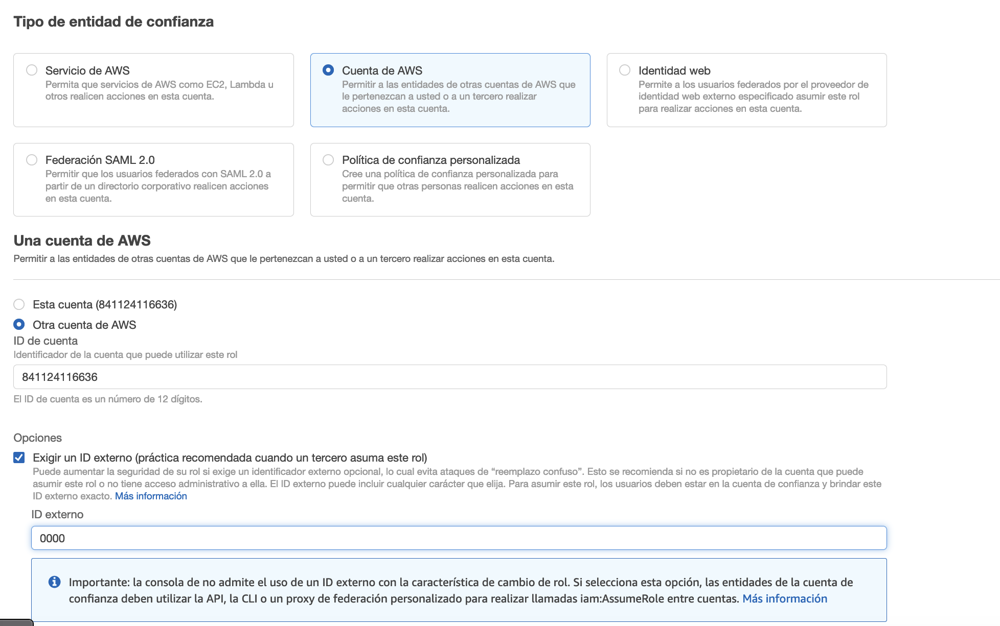
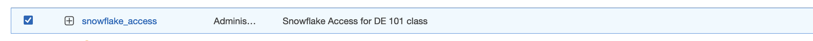
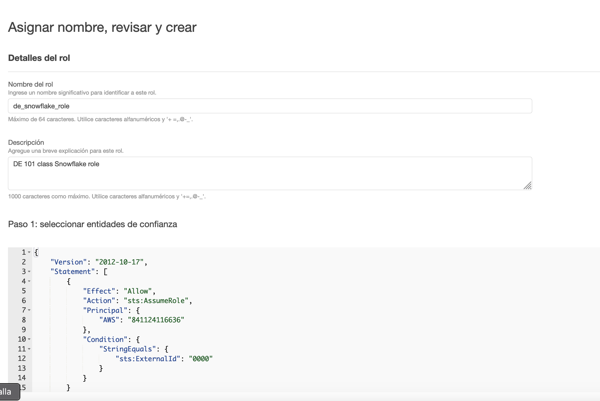

# Datalake-with-S3-and-Snowflake
## Setup
1. Get an AWS account and get your [access keys](https://docs.aws.amazon.com/IAM/latest/UserGuide/id_credentials_access-keys.html) 
2. Install the [AWS CLI](https://aws.amazon.com/cli/)
3. Get a [Snowflake account](https://signup.snowflake.com/)
4. Configure your AWS CLI with your IAM Access Keys:
```
# Sometimes you need to run it with sudo
aws configure
```
5. Enter your credentials and select your best configuration:
```
AWS Access Key ID [****************TWUX]: *
AWS Secret Access Key [****************9rWg]: *
Default region name [None]: us-east-1
Default output format [None]: json
```

## Practice
### AWS
- Create a new S3 bucket using the CLI (The name must be globally unique):
```
# You also can run without region param and it wil
aws s3 mb s3://YOURbucketNAME --region us-east-2
```
Alternative you can create directly from [AWS console](https://docs.aws.amazon.com/AmazonS3/latest/userguide/GetStartedWithS3.html)

- Copy the [alcohol-consumption-2021.csv](alcohol-consumption-2021.csv) file to your bucket:

```
# You can do it also using the web console
aws s3 cp alcohol-consumption-2021.csv s3://YOURbucketNAME
```

- Create a new access policy for the previous bucket using CLI:
```
aws iam create-policy --policy-name my-snowflake-policies --policy-document s3-policy.json --region us-east-2
```

If you don't have iam:CreatePolicy attach to your AWS user you can do it using [AWS console](https://docs.aws.amazon.com/IAM/latest/UserGuide/access_policies_create-console.html).
Please check the content of the s3-policy.json in order to know which policies attach.

- Create a new role using our previous policies

1. Select "Another AWS account" and use your same Account ID.

2. Select the "External ID" option and use a random number like "0000".



3. Select the policy that you've created in the previous step.



4. Write a name for your role and a description. That's it.



### Snowflake

1. Use a new worksheet.

2. Change to the admin account:

```
# Switch to accountadmin
USE role accountadmin;
```

3. Create a storage integration:

```
CREATE OR REPLACE STORAGE INTEGRATION s3_int
	TYPE = EXTERNAL_STAGE
	STORAGE_PROVIDER = S3
	ENABLED = TRUE
	STORAGE_AWS_ROLE_ARN = 'arn:aws:iam::00YourRandomNum00:role/YOUR-ROLE-NAME'
	STORAGE_ALLOWED_LOCATIONS = ( 's3://YOURbucketNAME' );

```

A storage integration is a Snowflake object that stores a generated identity and access management (IAM) user for your S3 cloud storage, along with an optional set of allowed or blocked storage locations.

In order to know more about AWS ARN (Amazon Resource Names) you can check [this.](https://docs.aws.amazon.com/general/latest/gr/aws-arns-and-namespaces.html)


4. Retrieve the AWS IAM User for your Snowflake Account.

```
DESC INTEGRATION s3_int;
```